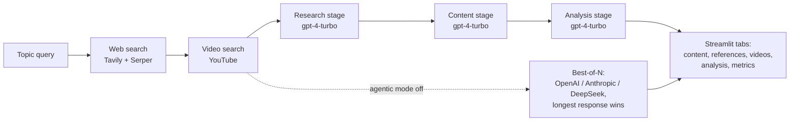

# Multi-Model Research Agent

Multi-Model Research Agent is a Streamlit research application that turns a single topic query into a sourced research document: it gathers web results (Tavily, Serper), ranks related YouTube videos by view count, and generates the write-up with commercial LLMs (GPT-4 Turbo, Claude 3.5 Sonnet, optionally DeepSeek). It is aimed at individual researchers and analysts who want a one-screen "search, synthesize, cite" loop without assembling the pipeline themselves.

The repository contains two variants:

| File | Role |
|---|---|
| `research_agent_app.py` | Primary app. Optional role-specialized generation chain (research, content, analysis), multi-provider fallback, tabbed UI with metrics. |
| `multi-model-research-agent.py` | Baseline app. Two-provider generation (OpenAI + Anthropic), pick-longest selection, simpler two-column UI. Run by the devcontainer. |

## Architecture at a glance

- **Orchestration pattern:** a **sequential pipeline** driven by a single coordinator class (`SageLensAgenticSystem`): web search, then video search, then a three-stage role-prompt chain (research, content, analysis). There is no parallelism, no inter-agent negotiation, and no autonomous tool loop. In the enhanced app the "agents" are role-instruction prompt templates: the OpenAI Agents SDK `Agent` objects are constructed if the SDK is installed, but `_generate_with_agent` deliberately bypasses the SDK `Runner` and calls the Chat Completions API directly with each agent's instructions prepended to the prompt.
- **Fallback mode (best-of-N):** when agentic mode is off or unavailable, the same prompt is sent to OpenAI, Anthropic, and DeepSeek in sequence and the longest response is kept.
- **Models:** `gpt-4-turbo` (OpenAI), `claude-3-5-sonnet-20241022` (Anthropic), `deepseek-chat` (DeepSeek, OpenAI-compatible endpoint, enhanced app only).
- **Retrieval:** Tavily and Serper web search plus `youtube_search` scraping; the top web snippets are injected into the generation prompt as context. There is no vector store and no embedding-based retrieval.
- **State:** Streamlit `st.session_state` only — per-browser-session, in-memory result history. Nothing is persisted to disk or a database.



See [docs/ARCHITECTURE.md](docs/ARCHITECTURE.md) for the full component map and data flow.

## Quickstart

```bash
git clone https://github.com/git-bonda108/multi-model-research-agent.git
cd multi-model-research-agent
pip install -r requirements.txt

# create your key file
cp .env.example .env   # then edit .env with real keys

# optional: verify the environment
python test_setup.py
# expected: a checklist of package imports and key presence,
# ending "✅ Setup complete - ready to run!" (or "will run in standard mode"
# if the openai-agents package is absent)

streamlit run research_agent_app.py
# expected: "You can now view your Streamlit app in your browser."
# then open http://localhost:8501
```

To run the baseline variant instead: `streamlit run multi-model-research-agent.py` (this one requires both `OPENAI_API_KEY` and `ANTHROPIC_API_KEY`).

## Configuration

Keys are read from Streamlit secrets first (`st.secrets`, for Streamlit Cloud), then from environment variables / `.env` (`python-dotenv`).

| Variable | Required | Used for | Where to get it |
|---|---|---|---|
| `OPENAI_API_KEY` | Yes (both apps) | GPT-4 Turbo generation; all three role stages | https://platform.openai.com/api-keys |
| `ANTHROPIC_API_KEY` | Baseline: yes. Enhanced: optional | Claude 3.5 Sonnet generation (fallback mode) | https://console.anthropic.com/settings/keys |
| `DEEPSEEK_API_KEY` | Optional (enhanced only) | `deepseek-chat` generation (fallback mode) | https://platform.deepseek.com |
| `TAVILY_API_KEY` | Optional | Semantic web search | https://tavily.com |
| `SERPER_API_KEY` | Optional | Google search via Serper (organic + knowledge graph) | https://serper.dev |

With no search keys configured the app still generates content, but the References tab will be empty. YouTube search needs no key.

## Documentation

- [docs/ARCHITECTURE.md](docs/ARCHITECTURE.md) — component map, data flow, orchestration analysis, design trade-offs
- [docs/EVALUATION.md](docs/EVALUATION.md) — what is actually tested today, edge cases handled in code, and a proposed evaluation harness
- [docs/HARDENING.md](docs/HARDENING.md) — current security posture and a staged path to production

Historical setup and deployment notes from earlier iterations remain in the repository root (`DEPLOYMENT_INSTRUCTIONS.md`, `QUICKSTART.md`, and similar); the three documents above are the maintained reference.

## MCP server — research capabilities for any MCP client

`mcp_server/research_mcp.py` exposes the pipeline over the Model Context
Protocol (stdio), so Claude Desktop, IDEs, or agent runtimes can use Multi-Model Research Agent
as a tool provider:

| Tool | Capability | Resilience behavior |
|------|------------|---------------------|
| `web_search` | Web research | Tavily primary → automatic Serper failover; errors reported, never raised |
| `video_search` | YouTube curation | results ranked by view count |
| `generate_report` | Research-report generation | multi-model fallback chain: gpt-4-turbo → claude-3-5-sonnet → deepseek-chat; skips unconfigured providers, degrades past failures, returns the attempt trail |
| `provider_status` | Capability introspection | live view of configured providers and the fallback order |

A `research://capabilities` resource publishes the machine-readable manifest
(tools, models, failover order, degradation contract).

```bash
pip install -r mcp_server/requirements.txt
python mcp_server/research_mcp.py
```

The same graceful-degradation contract governs the Streamlit app: generation
runs across all configured providers and continues with whichever succeed.
